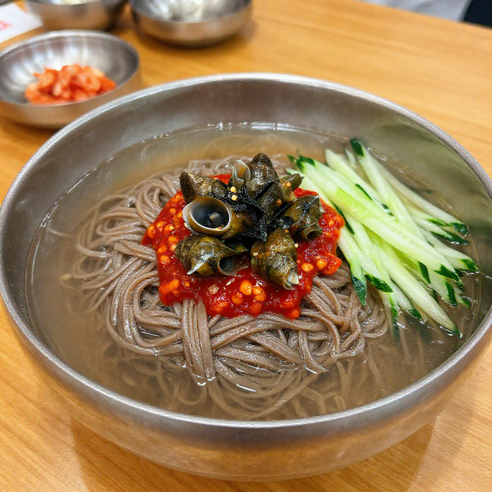

# 골뱅이 막국수

> ⏱️ 조리시간: 15분 | 🍽️ 2인분 | 난이도: ⭐ 쉬움

## 📝 재료
- 메밀면 (또는 소면) — 2인분 (200g)
- 골뱅이 통조림 — 1캔 (140g)
- 오이 — 1/2개
- 양파 — 1/4개
- 깻잎 — 5장
- 삶은 달걀 — 1개

### 양념장
- 고추장 — 2큰술
- 식초 — 2큰술
- 설탕 — 1큰술
- 간장 — 1큰술
- 고춧가루 — 1큰술
- 참기름 — 1큰술
- 다진 마늘 — 1/2작은술
- 통깨 — 약간

## 👨‍🍳 만드는 법
1. 오이는 채 썰고, 양파는 얇게 슬라이스, 깻잎은 돌돌 말아 채 썰어 준비해요.
2. 양념장 재료를 모두 섞어 잘 풀어주세요.
3. 골뱅이는 국물을 버리고 먹기 좋은 크기로 썰어주세요.
4. 끓는 물에 메밀면을 삶은 뒤 찬물에 여러 번 헹궈 전분기를 빼고 물기를 탈탈 털어주세요.
5. 그릇에 면을 담고 골뱅이, 오이, 양파, 깻잎을 올려주세요.
6. 양념장을 끼얹고 삶은 달걀 반으로 잘라 올리면 완성!

## 💡 꿀팁
- 면은 충분히 찬물에 헹궈야 쫄깃한 식감이 살아요. 얼음물을 쓰면 더 좋아요.
- 골뱅이 국물을 양념장에 1~2큰술 섞으면 감칠맛이 더해져요.
- 매운 걸 좋아하면 청양고추를 송송 썰어 올려보세요.
- 소면으로 대체해도 맛있지만, 메밀면이 양념장과 더 잘 어울려요.
- 남은 골뱅이는 밀폐용기에 옮겨 냉장 보관하고 2~3일 안에 드세요.
