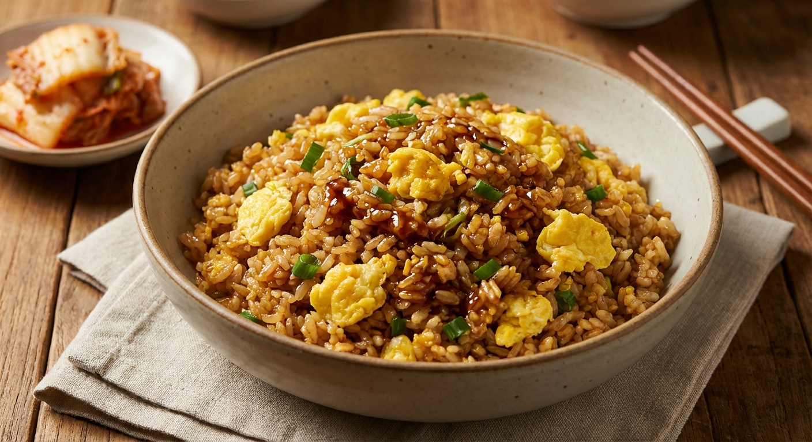

# 굴소스 볶음밥

> ⏱️ 조리시간: 10분 | 🍽️ 1인분 | 난이도: ⭐ 쉬움

## 📝 재료
- 밥 — 1공기 (200g)
- 굴소스 — 1.5큰술
- 달걀 — 1개
- 대파 — 1/4대 (없으면 냉동 다진파 1큰술)
- 마늘 — 2쪽 (없으면 다진마늘 1작은술)
- 식용유 — 1.5큰술
- 참기름 — 1/2작은술
- 후추 — 약간

## 👨‍🍳 만드는 법
1. 대파는 송송 썰고, 마늘은 얇게 편으로 썰어 준비해요. (냉동 다진파·다진마늘이라면 그냥 계량만 하면 돼요!)
2. 팬을 센불에 올리고 식용유를 두른 뒤, 마늘을 넣고 30초 정도 볶아 향을 내세요.
3. 달걀을 팬에 바로 깨 넣고 젓가락이나 주걱으로 빠르게 휘저어 스크램블 상태로 만들어요.
4. 달걀이 반쯤 익었을 때 밥을 넣고 주걱으로 꾹꾹 눌러가며 덩어리를 풀어주세요.
5. 굴소스를 넣고 밥 전체에 골고루 섞이도록 30초~1분 볶아요.
6. 대파를 넣고 10초 더 볶은 뒤 불을 끄세요.
7. 마지막에 참기름 한 방울, 후추 약간 뿌리면 완성이에요!

## 💡 꿀팁
- 찬밥을 사용하면 볶음밥이 훨씬 더 잘 됩니다. 막 지은 밥은 뚜껑을 열어 5분 정도 식혀서 수분을 날려주세요.
- 팬 하나만 쓰는 레시피라 설거지가 최소화돼요. 그릇에 바로 덜어 먹으면 팬 하나, 그릇 하나로 끝!
- 굴소스가 없다면 간장 1큰술 + 굴소스 없이 해도 맛있고, 굴소스 대신 간장 1큰술 + 설탕 1/4작은술 조합도 OK!
- 냉장고 속 남은 채소(양파, 당근, 옥수수 등)를 2단계에서 함께 볶으면 더 든든하게 즐길 수 있어요.
- 대파 대신 김가루를 마지막에 올려도 맛있어요!
ㅡㅡㅡㅡㅡ 이것