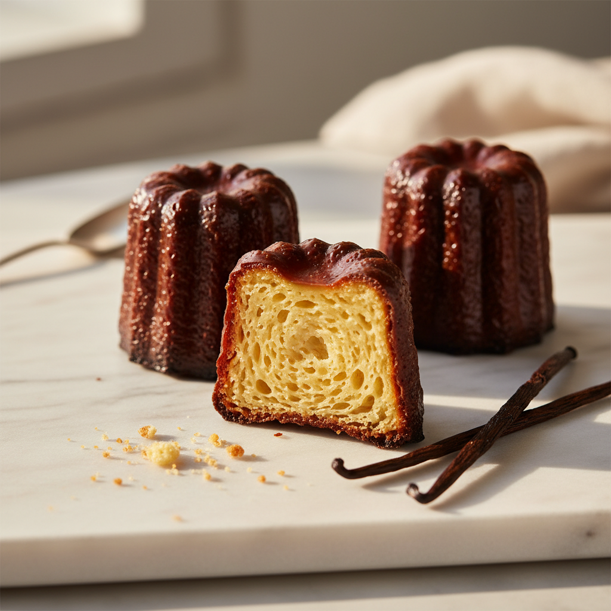

# 까눌레 드 보르도 (Canelé de Bordeaux)

> ⏱️ 준비: 30분 | 🔥 굽기: 60분 | 🕐 총 소요: 26시간 (반죽 휴지 24시간 포함) | 🍽️ 12개 | 난이도: ⭐⭐⭐ 고급

*"까눌레는 보르도의 영혼입니다. 겉은 캐러멜처럼 어두운 마호가니빛으로 바삭하고, 속은 커스터드처럼 촉촉하게 떨리죠. Maison Lumière에서 이 작은 과자 하나를 완성하는 데 3년이 걸렸어요 — 비밀은 인내심과 밀랍, 그리고 하룻밤의 기다림에 있습니다."*

---

## 📋 준비물

### 도구
- 까눌레 전용 구리 틀 12구 (지름 5.5cm, 높이 5cm) 또는 실리콘 까눌레 틀
- 디지털 주방 저울 (1g 단위)
- 즉석 탐침 온도계
- 중간 크기 냄비 1개
- 볼 2개 이상
- 거품기 (위스크)
- 고무 주걱 (스패출라)
- 체 (밀가루용)
- 밀랍 (Cire d'abeille) — 50g (틀 코팅용, 선택이지만 강력 권장)
- 버터 (무염) — 틀 코팅용 30g (밀랍과 혼합)
- 식힘망 (냉각 랙)
- 내열 유리 용기 또는 피처 (반죽 보관 및 부어넣기용)

---

### 재료

#### 까눌레 반죽 — Appareil à Canelé (아파레이유 아 까눌레)
- 우유 (전지, 3.5% 이상) — 500ml
- 버터 (무염) — 25g
- 달걀 (상온, M 사이즈) — 50g (1개)
- 달걀 노른자 (상온) — 40g (약 2개)
- 설탕 (백설탕) — 250g
- 중력분 (체 친 것) — 100g
- 다크 럼 (Rhum Brun, 숙성 럼) — 30ml
- 바닐라 빈 — 1개 (또는 바닐라 페이스트 5ml)

#### 틀 코팅 — Chemisage (슈미자주)
- 밀랍 (Cire d'abeille, 식용 등급) — 50g
- 버터 (무염) — 30g

---

## 👨‍🍳 만드는 법

### 1단계: 반죽 만들기 (Appareil)

1. 냄비에 우유 500ml를 붓고 바닐라 빈의 씨를 긁어 함께 넣습니다 (깍지도 함께). 버터 25g을 넣고 **중불에서 가장자리에 기포가 생기는 85°C**까지 가열합니다. 끓이지 않도록 주의하세요.
2. 볼에 설탕 250g과 체 친 중력분 100g을 넣고 거품기로 가볍게 섞어 줍니다 (마른 재료 혼합).
3. 별도의 볼에 달걀 50g과 달걀 노른자 40g을 풀어줍니다. **절대 거품이 나도록 세게 치지 마세요** — 가볍게 풀기만 하면 됩니다.
4. 마른 재료 볼에 풀어둔 달걀을 넣고 거품기로 매끄럽게 섞습니다.
5. 뜨거운 우유를 **3~4회에 나누어** 달걀-밀가루 혼합물에 부으면서 천천히 섞습니다. 한 번에 부으면 밀가루가 뭉치거나 달걀이 익을 수 있습니다.
6. 다크 럼 30ml를 넣고 가볍게 섞습니다.
7. 반죽을 체에 한 번 걸러 덩어리와 바닐라 깍지를 제거합니다. 내열 용기나 피처에 옮겨 담고 밀착랩을 씌웁니다.
8. **냉장고에서 최소 24시간, 최대 48시간 휴지시킵니다.** 이것이 까눌레 반죽의 가장 중요한 단계입니다.

---

### 2단계: 틀 코팅하기 (Chemisage — 슈미자주)

> 까눌레의 바삭한 캐러멜 껍질을 만드는 핵심 단계입니다. 밀랍 코팅은 전통 보르도 까눌레의 정체성 그 자체입니다.

1. 굽기 직전, 작은 냄비에 밀랍 50g과 버터 30g을 넣고 **약불에서 천천히 녹입니다** (70~80°C). 잘 섞어 균일한 액체 상태로 만듭니다.
2. 까눌레 틀을 **오븐에 넣어 5분간 예열합니다 (약 100°C)**. 따뜻한 틀에 밀랍-버터 혼합물을 부어 코팅합니다.
3. 틀을 뒤집어 여분의 밀랍을 빼냅니다 — **아주 얇고 균일한 코팅만 남아야** 합니다. 너무 두꺼우면 까눌레가 기름져 보입니다.
4. 코팅된 틀을 **냉장고에 15~20분** 넣어 밀랍을 완전히 굳힙니다.

---

### 3단계: 굽기 (Cuisson)

1. 오븐을 **250°C (일반 오븐)** 또는 **230°C (컨벡션)**으로 예열합니다.
2. 냉장고에서 반죽을 꺼내 거품기로 가볍게 한 번 저어 균일하게 만듭니다. **거품이 생기지 않도록 주의하세요.**
3. 냉장고에서 코팅된 틀을 꺼내 반죽을 **틀 높이의 약 80% (1cm 여유)**까지 부어줍니다. 가득 채우면 넘칩니다.
4. **250°C에서 15분** 굽습니다. 이 고온 단계에서 반죽이 급격히 팽창하며 캐러멜화가 시작됩니다.
5. **오븐 문을 열지 않고** 온도를 **180°C (일반 오븐)** 또는 **170°C (컨벡션)**으로 낮추어 **45~50분 더 굽습니다**.
6. 까눌레 윗면(틀 바닥 방향)이 **짙은 마호가니빛 갈색**이 되면 완성입니다. 너무 밝으면 아직 덜 구워진 것이고, 검게 탄 것이 아니라면 충분히 어두워도 괜찮습니다.
7. 오븐에서 꺼내자마자 **즉시 틀을 뒤집어 까눌레를 분리합니다**. 틀에 오래 두면 밀랍이 다시 굳어 분리가 어려워집니다.
8. 식힘망 위에 올려 **최소 30분** 식힙니다.

---

## 🔬 왜 이렇게 하나요? (과학적 원리)

- **반죽 24시간 휴지 (레포, Repos)**: 밀가루의 글루텐이 수분을 충분히 흡수하고 이완되면서 반죽이 균일해지고, 전분이 완전히 수화됩니다. 또한 반죽 속 기포가 자연스럽게 빠져나가 굽는 동안 과도한 팽창(배 불뚝해짐)을 방지합니다. 이 휴지 시간이 까눌레 내부의 매끈한 커스터드 질감을 결정합니다.

- **달걀을 거품 내지 않는 이유**: 까눌레 반죽에 공기가 들어가면 굽는 동안 과도하게 부풀어 올라 속이 비어 공동(Cavity)이 생기고, 식으면서 꺼져 찌그러진 모양이 됩니다. 밀가루와 달걀을 섞을 때 가능한 한 적은 공기를 포함시키는 것이 핵심입니다.

- **밀랍 코팅 (슈미자주, Chemisage)**: 밀랍은 녹는점이 약 62~65°C로, 오븐에서 서서히 녹으면서 반죽 표면에 얇은 방수층을 형성합니다. 이 덕분에 표면의 수분이 빠르게 증발하고 당분이 캐러멜화되어 특유의 바삭하고 어두운 껍질이 만들어집니다. 버터만으로는 이 효과를 재현할 수 없습니다.

- **2단계 온도 굽기 (고온 → 저온)**: 처음 250°C 고온에서 반죽 표면을 급격히 캐러멜화하고 구조를 잡은 뒤, 180°C로 낮추어 내부를 천천히 익히는 것입니다. 처음부터 낮은 온도로 구우면 캐러멜 껍질이 형성되지 않고, 계속 고온이면 겉은 타고 속은 덜 익습니다.

- **높은 설탕 비율 (250g)**: 까눌레의 설탕 비율은 매우 높습니다. 이 설탕이 마이야르 반응(Maillard Reaction)과 캐러멜화(Caramélisation)를 통해 특유의 깊은 풍미와 색, 그리고 바삭한 질감을 만들어냅니다.

- **구리 틀의 열전도성**: 전통 구리 까눌레 틀은 열전도율이 매우 높아(알루미늄의 약 1.7배) 반죽 전체에 열을 균일하고 빠르게 전달합니다. 이것이 전면 고르게 캐러멜화된 껍질을 만드는 비결입니다. 실리콘 틀은 열전도가 낮아 같은 결과를 얻기 어렵습니다.

---

## ⚠️ 흔한 실수와 해결법

- **문제**: 까눌레가 틀에서 빠지지 않는다 → **해결**: 밀랍 코팅이 불균일하거나 부족한 것이 원인입니다. 틀을 충분히 예열한 뒤 밀랍-버터 혼합물을 고르게 바르고, 반드시 뒤집어 여분을 빼세요. 또한 오븐에서 꺼낸 직후 바로 뒤집어야 합니다 — 30초만 지체해도 밀랍이 굳기 시작합니다.

- **문제**: 속이 텅 비어 있고 공동(Cavity)이 크게 생겼다 → **해결**: 반죽에 공기가 너무 많이 들어갔거나 휴지 시간이 부족한 것입니다. 달걀을 풀 때 절대 거품을 내지 말고, 반죽을 체에 거른 뒤 최소 24시간 냉장 휴지하세요. 굽기 전 반죽을 저을 때도 공기가 들어가지 않도록 조심합니다.

- **문제**: 겉은 밝고 바삭하지 않으며, 속이 설익어 흐물거린다 → **해결**: 굽는 시간이 부족하거나 오븐 온도가 낮은 것입니다. 가정용 오븐은 표시 온도보다 실제 온도가 10~20°C 낮은 경우가 많으므로 오븐 온도계로 확인하세요. 까눌레는 "이 정도면 너무 어두운 것 아닌가?"라고 느낄 때가 적정 색입니다. 용기를 내세요.

- **문제**: 까눌레가 굽는 중에 틀 밖으로 솟아올랐다 (버섯 현상) → **해결**: 반죽을 너무 많이 부었거나 오븐 초반 온도가 너무 높은 것입니다. 틀의 80%까지만 채우고, 오븐 예열 온도를 확인하세요. 또한 반죽의 휴지가 충분하지 않으면 반죽 속 공기와 수증기가 과하게 팽창합니다.

---

## 🎨 플레이팅 & 변형

**클래식 서빙**
- 까눌레는 구운 뒤 **1~4시간 사이가 가장 완벽한 상태**입니다. 겉은 바삭하고 속은 촉촉한 카스타드로 떨리는 질감이 살아 있습니다.
- 작은 흰 접시에 까눌레 1~2개를 놓고, 슈가파우더 없이 그 자체의 마호가니빛 광택을 살리는 것이 보르도 스타일입니다.
- 에스프레소 또는 보르도 와인(소테른 Sauternes 같은 귀부 와인)과 페어링하면 훌륭합니다.

**변형 아이디어**
- **까눌레 오 테 마차 (Canelé au Thé Matcha)**: 반죽에 말차 가루 8g을 우유에 함께 풀어 넣습니다. 럼 대신 유자즙 15ml를 사용하면 일본-프랑스 퓨전 까눌레가 됩니다.
- **까눌레 쇼콜라 (Canelé au Chocolat)**: 반죽에 코코아 파우더 20g을 밀가루에 혼합하고, 다크 커버처 초콜릿 50g을 우유에 녹여 넣습니다. 럼과 초콜릿의 조합은 클래식입니다.
- **까눌레 살레 (Canelé Salé)**: 설탕을 80g으로 줄이고, 콩테 치즈(Comté) 간 것 60g을 반죽에 넣어 짭짤한 아페리티프용 까눌레를 만듭니다. 보르도 레드 와인과 완벽한 조합입니다.
- **미니 까눌레 (Petit Canelé)**: 지름 3.5cm 미니 틀을 사용하면 한 입 크기의 까눌레가 됩니다. 굽는 시간을 **250°C 10분 + 180°C 30분**으로 줄여주세요. 디저트 뷔페나 선물용으로 사랑스럽습니다.

---

## 💡 Chef Sophie의 팁

- **구리 틀에 투자하세요.** 실리콘 틀로도 까눌레를 만들 수 있지만, 진짜 보르도 까눌레의 바삭한 캐러멜 껍질은 구리 틀에서만 탄생합니다. Maison Lumière에서 사용하던 구리 틀은 20년이 넘은 것이었어요 — 좋은 구리 틀은 평생 쓸 수 있는 도구입니다.

- **반죽은 48시간 휴지가 이상적입니다.** 24시간이 최소이지만, 제가 가장 좋아하는 결과물은 항상 48시간 휴지한 반죽에서 나왔습니다. 글루텐이 완전히 이완되고 풍미가 한층 깊어집니다.

- **반죽을 부을 때 거품을 걷어내세요.** 냉장고에서 꺼낸 반죽 표면에 미세한 거품이 생겨 있을 수 있습니다. 스푼으로 이 거품을 걷어내고 틀에 부으면 속의 공동 발생을 줄일 수 있습니다.

- **굽기 전 반죽은 차가운 상태 그대로 사용하세요.** 상온에 미리 꺼내 두지 않습니다. 차가운 반죽이 뜨거운 틀에 들어가면 온도 차이로 인해 밀랍 코팅이 순간적으로 굳으면서 반죽과 틀 사이에 완벽한 막을 형성합니다.

- **까눌레는 당일이 생명입니다.** 시간이 지나면 껍질이 공기 중 수분을 흡수해 바삭함을 잃습니다. 구운 지 4시간 이내에 드시는 것이 최상이며, 남은 것은 밀폐 용기에 보관 후 다음 날 **200°C 오븐에서 5분** 데워 바삭함을 되살릴 수 있습니다.

- **Maison Lumière의 비밀** — 럼은 반드시 숙성 다크 럼(Rhum Vieux)을 사용하세요. 화이트 럼은 알코올의 날카로운 향만 남기지만, 오크통에서 숙성된 다크 럼은 바닐라, 카라멜, 건과일의 복합적인 향을 더해 까눌레의 풍미를 한 차원 높여줍니다.
