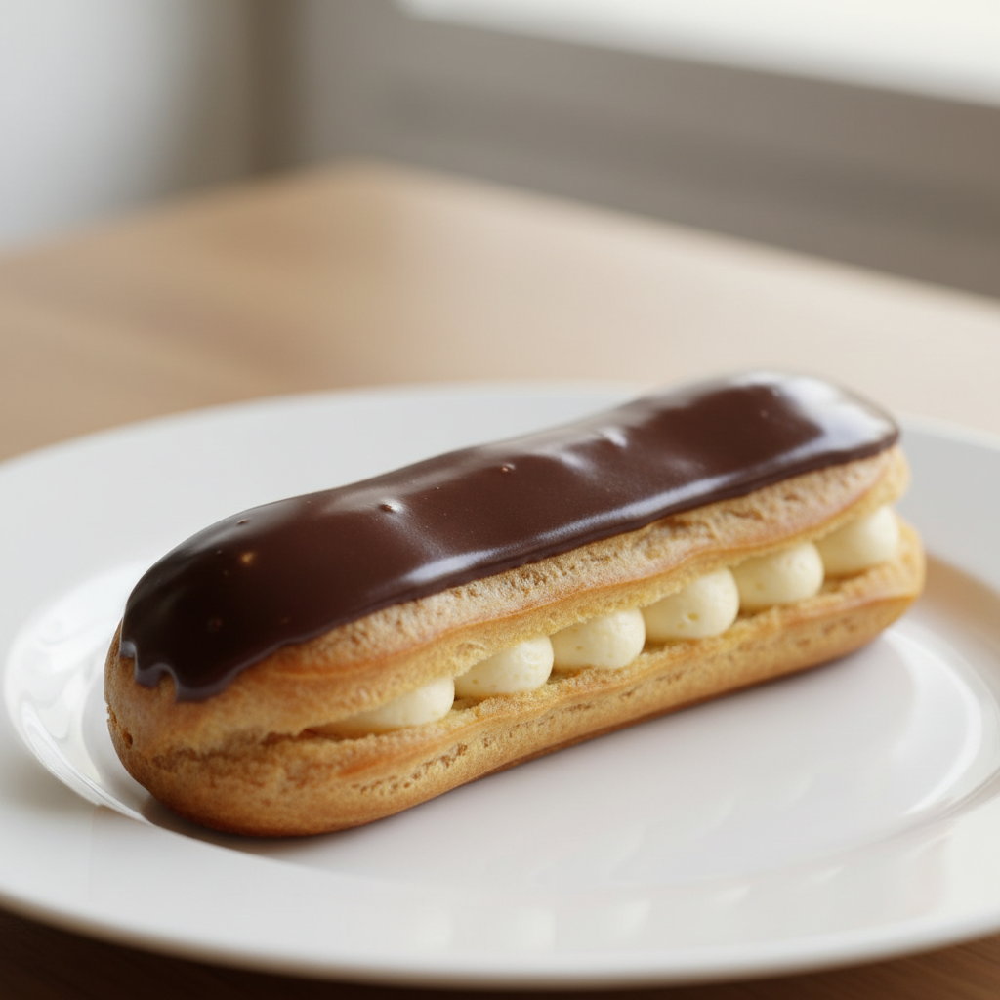

# 에끌레르 오 쇼콜라 (Éclair au Chocolat)

> ⏱️ 준비: 90분 | 🔥 굽기: 35분 | 🕐 총 소요: 4시간 (냉장 안정화 포함) | 🍽️ 12개 | 난이도: ⭐⭐⭐ 고급

*"에끌레르는 프랑스 파티스리의 정직한 시험지입니다. 슈가 부풀어 오르는 소리, 크렘이 매끄럽게 파이핑되는 감촉, 글라사주가 거울처럼 굳는 순간 — 이 모든 것이 맞아떨어질 때, 저는 여전히 Maison Lumière 주방의 새벽 공기를 떠올립니다."*

---

## 📋 준비물

### 도구
- 스탠드 믹서 또는 핸드 믹서
- 디지털 주방 저울 (1g 단위)
- 즉석 탐침 온도계
- 중간 크기 냄비 2개
- 고무 주걱 (스패출라)
- 거품기 (위스크)
- 짤주머니 2개 + 원형 깍지 12mm (슈 반죽용) + 별 깍지 또는 가는 원형 깍지 6mm (크림 충전용)
- 베이킹 트레이 2개 + 유산지 (실팻 매트 권장)
- 볼 3개 이상
- 체 (밀가루용)
- 오프셋 스패출라 (팔레트 나이프)
- 얕고 넓은 트레이 (글라사주용)
- 냉각 랙 (식힘망)

---

### 재료

#### 슈 반죽 — Pâte à Choux (파트 아 슈)
- 물 — 125ml
- 우유 (전지, 3.5% 이상) — 125ml
- 버터 (무염) — 110g
- 소금 — 3g
- 설탕 — 5g
- 중력분 (체 친 것) — 140g
- 달걀 (상온, M 사이즈) — 약 250g (4~5개, 아래 설명 참고)

#### 크렘 파티시에르 오 쇼콜라 — Crème Pâtissière au Chocolat (초콜릿 커스터드 크림)
- 우유 (전지) — 500ml
- 달걀 노른자 — 120g (약 6개)
- 설탕 — 100g
- 옥수수 전분 (Maïzena) — 40g
- 다크 커버처 초콜릿 (카카오 64% 이상, 잘게 다진 것) — 120g
- 버터 (무염) — 30g
- 바닐라 빈 — 1개 (또는 바닐라 페이스트 5ml)

#### 초콜릿 글라사주 — Glaçage au Chocolat (퐁당 쇼콜라 글라스)
- 다크 커버처 초콜릿 (카카오 64% 이상) — 200g
- 생크림 (지방 35% 이상) — 160ml
- 물엿 (글루코스 시럽) — 30g
- 버터 (무염) — 20g

---

## 👨‍🍳 만드는 법

### 1단계: 슈 반죽 만들기 (Pâte à Choux)

1. 오븐을 **190°C (컨벡션)** 또는 **200°C (일반 오븐)**으로 예열합니다. 베이킹 트레이에 유산지 또는 실팻 매트를 깔아 준비합니다.
2. 냄비에 물 125ml, 우유 125ml, 버터 110g, 소금 3g, 설탕 5g을 넣고 **중강불에서 버터가 완전히 녹을 때까지** 가열합니다. 액체가 끓어오르는 순간 바로 다음 단계로 넘어갑니다 — 너무 오래 끓이면 수분이 증발합니다.
3. 불을 끄고 체 친 중력분 140g을 **한 번에** 냄비에 붓습니다. 고무 주걱으로 힘차게 저어 덩어리 없이 매끄러운 반죽을 만듭니다.
4. 냄비를 다시 **중불에 올려 1~2분간 계속 저으며 반죽을 말립니다(데세셰, Dessécher)**. 반죽이 냄비 옆면에서 깨끗하게 떨어지며 덩어리 지고, 냄비 바닥에 얇은 막이 생기면 충분히 건조된 것입니다.
5. 반죽을 믹서 볼로 옮겨 **패들 어태치먼트로 1~2분 저속으로 돌려** 열기를 60°C 이하로 식힙니다 (달걀이 익지 않도록).
6. 달걀을 미리 풀어서 계량합니다 (약 250g, 4~5개). 식힌 반죽에 달걀을 **조금씩 나누어 (한 번에 약 50g씩)** 넣으면서 중속으로 섞습니다. 달걀을 모두 넣을 필요는 없습니다 — **반죽을 주걱으로 들어 올렸을 때 역삼각형으로 천천히 떨어지며, 주걱에 남은 반죽이 V자 모양을 이루면** 완성입니다.
7. 12mm 원형 깍지를 끼운 짤주머니에 반죽을 담고, 준비한 트레이에 **길이 12cm, 너비 2.5cm**의 일정한 타원형으로 짭니다. 간격은 최소 5cm씩 유지합니다. 짜낸 반죽의 끝부분을 손가락에 물을 묻혀 가볍게 눌러 정리합니다.
8. **190°C (컨벡션)에서 32~35분** 굽습니다. 굽는 중에는 절대 오븐 문을 열지 마세요 — 내부 수증기가 빠져나가면 슈가 꺼집니다. 황금빛 갈색으로 골고루 착색되고 옆면까지 단단하게 굳으면 완성입니다.
9. 오븐에서 꺼낸 직후 이쑤시개나 꼬치로 에끌레르 측면에 작은 구멍을 내어 내부 증기를 빠져나가게 합니다. 식힘망 위에 올려 완전히 식힙니다.

---

### 2단계: 크렘 파티시에르 오 쇼콜라 만들기 (Crème Pâtissière au Chocolat)

1. 냄비에 우유 500ml와 바닐라 빈 씨 + 깍지를 넣고 **중불에서 가장자리에 기포가 생기는 85°C**까지 가열합니다.
2. 볼에 달걀 노른자 120g과 설탕 100g을 넣고 거품기로 연한 노란빛이 될 때까지 힘차게 풀어줍니다 (블랑시르, Blanchir).
3. 옥수수 전분 40g을 체에 내려 노른자 혼합물에 넣고 매끄럽게 섞습니다.
4. 뜨거운 우유를 **국자로 2~3번에 나누어** 노른자 볼에 먼저 부어 온도를 올립니다 (탕페르, Tempérer). 달걀이 익는 것을 방지하는 핵심 단계입니다.
5. 혼합물을 냄비로 옮겨 **중강불에서 거품기로 쉬지 않고 저으며** 끓입니다. 뻑뻑해지기 시작하면 불을 줄이고 **2분 더 저어** 전분을 완전히 호화시킵니다.
6. 불을 끄고 다진 다크 초콜릿 120g을 넣어 녹입니다. 부드럽게 섞인 뒤 버터 30g을 넣고 윤기가 날 때까지 섞습니다 (에멀시피카시옹, Émulsification).
7. 완성된 크림을 넓은 트레이로 옮겨 표면에 밀착랩(Contact Wrap)을 붙이고, 얼음물 위에 올려 빠르게 식힙니다. **4°C 이하로 완전히 냉장합니다 (최소 2시간).**

---

### 3단계: 초콜릿 글라사주 만들기 (Glaçage au Chocolat)

1. 생크림 160ml와 물엿 30g을 냄비에 넣고 **중불에서 80°C까지** 가열합니다 (끓이면 안 됩니다).
2. 다진 다크 초콜릿 200g이 담긴 볼에 뜨거운 크림을 붓습니다. 30초 기다린 뒤 중앙에서 바깥쪽으로 천천히 원을 그리며 저어 완전히 녹입니다.
3. 버터 20g을 넣고 핸드블렌더(스틱 믹서)로 유화시킵니다 — 이 단계가 글라사주의 거울 같은 광택을 만듭니다.
4. **사용 온도 28~32°C**가 될 때까지 실온에서 식힙니다. 너무 뜨거우면 흘러내리고, 너무 차가우면 두껍게 굳어 지저분해집니다.

---

### 4단계: 조립 (Montage)

1. 완전히 식은 에끌레르 바닥 또는 측면에 꼬치나 작은 깍지로 구멍을 **2~3곳** 냅니다 (양쪽 끝과 중앙).
2. 냉장된 크렘 파티시에르를 거품기로 풀어 매끄럽게 만든 뒤, 6mm 원형 깍지를 끼운 짤주머니에 담습니다.
3. 구멍에 깍지를 꽂고 **크림이 살짝 밀려 나올 때까지** 충전합니다. 에끌레르를 가볍게 흔들어 무게감이 고르면 잘 채워진 것입니다.
4. 글라사주를 얕은 트레이에 붓습니다. 크림이 채워진 에끌레르를 **윗면이 글라사주 표면에 닿도록 살짝 눌렀다가 한 번에 떼어냅니다**. 표면에 흘러내리는 여분의 글라사주는 손가락으로 가볍게 정리합니다.
5. 글라사주가 굳기 전에 금박, 카카오닙, 또는 작은 초콜릿 장식으로 신속하게 데코레이션합니다.
6. 식힘망 위에 올려 글라사주가 완전히 굳도록 **냉장고에 20~30분** 두었다가 서빙합니다.

---

## 🔬 왜 이렇게 하나요? (과학적 원리)

- **물과 우유를 반반 사용하는 이유 (슈 반죽)**: 물만 사용하면 크리스피하지만 색이 창백하고, 우유만 사용하면 유당이 캐러멜화되어 잘 타버립니다. 물 50% + 우유 50%의 비율은 황금빛 착색과 바삭한 껍질을 동시에 얻는 프랑스 정통 기법입니다.

- **반죽 건조(데세셰, Dessécher)의 역할**: 냄비에서 반죽을 말리는 과정은 수분을 제거해 달걀을 더 많이 흡수할 수 있는 상태로 만듭니다. 수분이 많이 남아 있으면 달걀을 충분히 넣기도 전에 반죽이 너무 묽어져 슈가 제대로 부풀지 않습니다.

- **달걀의 역할과 양 조절**: 달걀 속 수분이 오븐 열에 의해 수증기로 변하면서 슈를 부풀리는 것이 팽창의 핵심 원리입니다 (화학 팽창제 없음). 동시에 단백질이 구조를 굳혀 껍질을 형성합니다. 달걀 양은 반죽의 수분 함량에 따라 매번 다를 수 있어 고정값이 아닌 반죽 상태로 판단해야 합니다.

- **오븐 문을 열지 않는 이유**: 슈가 부푸는 초반 15분간은 내부 수증기압이 팽창의 원동력입니다. 오븐 문을 열면 수증기가 빠져나가고 내부 구조가 굳기 전에 주저앉아 다시는 부풀지 않습니다.

- **크렘 파티시에르의 전분 완전 호화**: 옥수수 전분은 70°C에서 호화가 시작되지만, 완전히 익히지 않으면 전분 효소가 남아 크림이 시간이 지나면서 다시 묽어집니다. 끓인 후 2분을 더 익히는 것은 이 효소 비활성화를 위한 필수 단계입니다.

- **글라사주 온도 28~32°C의 중요성**: 이 온도대에서 초콜릿의 결정이 적절하게 형성되어 굳은 후 광택이 납니다. 카카오버터의 안정적인 베타 결정(Beta V)을 유도하기 위한 탕페라주(Tempérage)의 원리와 동일합니다.

- **초콜릿 크림의 에멀시피카시옹(유화)**: 크렘 파티시에르에 초콜릿과 버터를 추가할 때 거품기로 힘차게 유화시키면 지방 분자가 수분 안에 균일하게 분산되어 부드럽고 윤기 있는 질감이 완성됩니다.

---

## ⚠️ 흔한 실수와 해결법

- **문제**: 에끌레르가 굽는 중에 납작하게 꺼졌다 → **해결**: 반죽이 너무 묽거나 (달걀을 과다 투입), 오븐 문을 일찍 열었거나, 오븐 온도가 낮았던 것이 원인입니다. 달걀은 반죽 상태를 보며 조금씩 추가하고, V자 반죽 테스트로 확인하세요. 오븐 온도계로 실제 오븐 내부 온도를 검증하는 것도 중요합니다 — 많은 가정용 오븐이 표시 온도보다 10~20°C 낮게 동작합니다.

- **문제**: 에끌레르 속이 비어 있지 않고 반죽이 덜 익어 촉촉하다 → **해결**: 굽는 시간이 부족하거나 온도가 낮은 것이 원인입니다. 색이 충분히 황금빛이 되고 껍질이 단단할 때까지 구워야 합니다. 꺼낸 직후 옆면에 구멍을 내 증기를 빼는 것이 내부를 건조하게 유지하는 데 도움이 됩니다. 필요하다면 5분 더 굽고 다시 확인하세요.

- **문제**: 글라사주가 너무 두껍게 입혀지거나 불투명하고 광택이 없다 → **해결**: 글라사주 온도가 너무 낮아진 것입니다. 중탕으로 살짝 다시 데워 32°C 이하로 맞추세요. 광택이 부족하다면 핸드블렌더로 다시 유화시키는 것도 효과적입니다.

- **문제**: 크렘 파티시에르에 덩어리가 생겼다 → **해결**: 달걀이 너무 빠른 속도로 가열되어 응고된 것입니다. 탕페르 단계(온도를 천천히 올리는 것)를 건너뛰었거나 불이 너무 강했을 가능성이 높습니다. 덩어리진 크림은 체에 걸러 사용할 수 있지만, 처음부터 다시 만드는 것이 가장 좋은 결과를 냅니다.

---

## 🎨 플레이팅 & 변형

**클래식 플레이팅**
- 서빙 직전 냉장고에서 꺼내 10분간 상온에 두어 크림의 질감을 살립니다.
- 흰 접시 위에 에끌레르 1개를 45도 각도로 비스듬히 놓고, 카카오 파우더를 가는 체로 곁에 가볍게 뿌립니다.
- 금박 조각 1~2장과 작은 식용 꽃(바이올렛 또는 로즈)으로 Maison Lumière 스타일의 미니멀한 플레이팅을 연출합니다.

**변형 아이디어**
- **에끌레르 카페 (Éclair au Café)**: 크렘 파티시에르에 진한 에스프레소 30ml를 추가하고 글라사주도 커피 퐁당(Fondant au Café)으로 바꾸어 클래식한 카페 에끌레르를 만듭니다.
- **에끌레르 프랑부아즈 (Éclair à la Framboise)**: 크림을 크렘 파티시에르 + 라즈베리 퓌레 혼합으로 바꾸고, 글라사주를 루비 초콜릿(Ruby Chocolate)으로 대체합니다. 봄·여름 계절 에끌레르로 인기가 높습니다.
- **살레 에끌레르 (Éclair Salé)**: 크림 충전물을 크림치즈 + 훈제연어 무스로 채우고 글라사주 없이 허브로 장식한 세이버리(짭짤한) 에끌레르는 아페리티프(식전주 안주)로 제공합니다.
- **미니 에끌레르 (Petits Éclairs)**: 길이 6cm로 작게 짜서 구우면 핑거푸드 사이즈의 미니 에끌레르가 됩니다. 파티 디저트 뷔페에 다양한 색상으로 배치하면 화려한 연출이 가능합니다.

---

## 💡 Chef Sophie의 팁

- **달걀은 항상 상온으로 준비하세요.** 차가운 달걀을 뜨거운 반죽에 넣으면 온도 충격으로 유화가 불안정해지고 반죽의 점도 조절이 어려워집니다. 사용 30분 전에 미리 꺼내 두세요.

- **슈 반죽을 짤 때는 트레이에 스프레이 물을 살짝 뿌리세요.** Maison Lumière에서 배운 작은 기법인데, 오븐 초반에 이 수분이 증기를 형성해 슈의 팽창을 돕습니다. 실팻 매트를 사용하면 이 효과가 자연스럽게 일어납니다.

- **글라사주는 에끌레르를 담갔다 빼는 것이 전부입니다.** 솔로 바르거나 여러 번 덧칠하면 표면이 울퉁불퉁해집니다. **딱 한 번, 자신 있게 담갔다 뗴어내는 것**이 파리 파티스리의 방법입니다.

- **크렘 파티시에르는 전날 미리 만들어 냉장하세요.** 하룻밤 냉장하면 크림의 질감이 더 안정되고 충전할 때 피어싱이 훨씬 수월합니다. 슈 반죽만 당일 굽는 전략이 시간 배분에도 유리합니다.

- **굽고 난 슈는 당일 사용하는 것이 원칙입니다.** 하지만 완전히 식힌 슈는 밀폐용기에 넣어 최대 24시간 실온 보관하거나, 냉동 보관 후 180°C 오븐에서 5분 데워 사용할 수 있습니다. 크림을 충전한 에끌레르는 냉장 보관 후 **24시간 이내**에 드세요.

- **물엿(글루코스 시럽)은 글라사주에서 결정화를 막는 핵심 재료입니다.** 없다면 꿀로 대체할 수 있지만, 꿀의 독특한 향이 초콜릿 향과 경쟁할 수 있으니 향이 약한 아카시아 꿀을 선택하세요.
