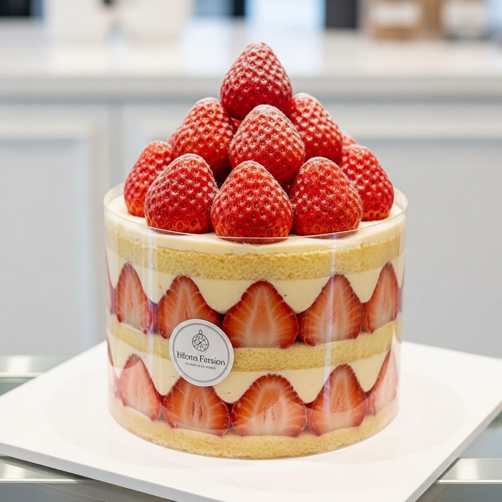

# 프레지에 (Fraisier)

> ⏱️ 준비: 120분 | 🔥 굽기: 25분 | 🕐 총 소요: 6시간 (냉장 안정화 포함) | 🍽️ 8인분 | 난이도: ⭐⭐⭐ 고급

*"프레지에는 단순한 케이크가 아닙니다 — 딸기가 제철을 맞이했음을 알리는 프랑스 봄의 선언이에요. Maison Lumière에서는 매년 첫 가리게 딸기(fraise de Gariguette)가 들어오는 날, 온 주방이 들뜨곤 했죠. 사랑하는 사람을 위해 만드는 케이크라면, 그 정성이 이미 최고의 재료입니다."*

---

## 📋 준비물

### 도구
- 지름 20cm 원형 무스 링 (높이 최소 6cm) 또는 스프링폼 팬
- 오프셋 스패출라 (팔레트 나이프)
- 핸드 믹서 또는 스탠드 믹서
- 디지털 주방 저울 (1g 단위)
- 즉석 온도계 (탐침형)
- 중간 크기 냄비 2개
- 볼 3개 이상
- 거품기 (위스크)
- 고무 주걱 (스패출라)
- 짤주머니 + 원형 깍지 (10mm)
- 아세테이트 시트 (무스 링 내벽 라이닝용, 선택)
- 체 (밀가루·슈가파우더용)
- 유산지 (베이킹페이퍼)

---

### 재료

#### 제노와즈 (Génoise — 제누아즈 비스퀴)
- 달걀 (상온) — 200g (약 4개, M 사이즈)
- 설탕 (백설탕) — 120g
- 박력분 (체 친 것) — 100g
- 버터 (무염, 녹인 것) — 30g
- 바닐라 익스트랙 — 5ml

#### 무슬린 크림 (Crème Mousseline — 버터 강화 커스터드)
- 우유 (전지, 3.5% 이상) — 500ml
- 달걀 노른자 — 100g (약 5개)
- 설탕 — 125g
- 옥수수 전분 (Maïzena) — 45g
- 버터 (무염, 상온 포마드 상태) — 150g
- 바닐라 빈 — 1개 (또는 바닐라 페이스트 5ml)

#### 시럽 (Sirop de Punchage — 시로프 드 팡샤쥬)
- 물 — 100ml
- 설탕 — 80g
- 키르슈 (Kirsch, 체리 브랜디) — 20ml (생략 가능, 딸기 퓌레로 대체)

#### 어셈블리 & 데코레이션
- 딸기 (신선한 것, 크기가 균일한 것) — 600g
- 나파주 뇌트르 (Nappage Neutre, 투명 글레이즈) — 50ml (시판 제품 또는 아래 대체법 참고)
- 슈가파우더 — 장식용 적당량
- 마지팬 (Massepain) — 150g (선택, 상단 마감용)

---

## 👨‍🍳 만드는 법

### 1단계: 제노와즈 굽기 (Génoise)

1. 오븐을 180°C (컨벡션 기준 165°C)로 예열합니다. 지름 20cm 원형 팬에 유산지를 깔고 버터를 바른 후 밀가루를 살짝 뿌려 준비합니다.
2. 냄비에 물을 약 5cm 깊이로 붓고 중불에 올립니다. 스테인리스 볼에 달걀 200g과 설탕 120g을 넣고 볼을 냄비 위에 올려 중탕합니다. (볼 바닥이 물에 닿지 않도록 주의)
3. 거품기로 저으면서 혼합물이 43~45°C에 도달할 때까지 가열합니다. 온도계로 반드시 확인하세요.
4. 볼을 냄비에서 내리고, 스탠드 믹서나 핸드 믹서로 **고속 8~10분** 동안 리본 단계(Stade au ruban)까지 휘핑합니다 — 거품기로 들어 올렸을 때 반죽이 떨어지면서 리본처럼 접혀야 합니다.
5. 체 친 박력분 100g을 3회에 나누어 넣고, 고무 주걱으로 **밑에서 위로 크게 접어 섞는** 방식(Folding)으로 혼합합니다. 글루텐이 발달하지 않도록 절대 빙글빙글 저으면 안 됩니다.
6. 녹인 버터 30g에 반죽 한 주걱을 먼저 넣어 섞은 뒤, 이것을 전체 반죽에 넣고 다시 접어 섞습니다 (버터 쇼크 방지).
7. 바닐라 익스트랙을 넣고 가볍게 한 번 더 폴딩합니다.
8. 준비한 팬에 반죽을 붓고 180°C 오븐에서 **22~25분** 굽습니다. 이쑤시개로 가운데를 찔러 깨끗하게 나오면 완성입니다.
9. 팬에서 꺼내 식힘망 위에 뒤집어 올려 완전히 식힙니다. 식으면 랩으로 감싸 냉장 보관 (이때 30분 이상 휴지시키면 시트 절단이 훨씬 수월합니다).

---

### 2단계: 무슬린 크림 만들기 (Crème Mousseline)

> 무슬린 크림은 크렘 파티시에르(Crème Pâtissière, 커스터드 크림)에 버터를 유화시켜 만드는 크림입니다. 가볍지만 구조감이 있어 프레지에의 핵심 크림입니다.

**[크렘 파티시에르 베이스 만들기]**

1. 냄비에 우유 500ml를 붓고 바닐라 빈의 씨를 긁어 함께 넣습니다 (깍지도 함께). 중불에서 가장자리에 작은 기포가 생기기 시작하는 **85°C까지** 가열합니다.
2. 볼에 달걀 노른자 100g과 설탕 125g을 넣고 거품기로 연노란 빛이 될 때까지 힘차게 풀어줍니다 (블랑시르, Blanchir).
3. 옥수수 전분 45g을 체에 내려 노른자 혼합물에 넣고 잘 섞어 매끄러운 페이스트 상태로 만듭니다.
4. 뜨거운 우유를 한 번에 붓지 않고, **국자로 두세 번 나누어 노른자 볼에 먼저 부어 온도를 올립니다(탕페르, Tempérer)**. 이렇게 해야 달걀이 익지 않습니다.
5. 온도를 올린 혼합물을 냄비로 다시 옮기고, **중강불에서 거품기로 쉬지 않고 저으면서** 끓입니다. 뻑뻑해지기 시작하면 불을 줄이고 2분을 더 저어 전분을 완전히 익힙니다.
6. 완성된 크렘 파티시에르를 넓은 트레이나 볼에 옮겨 담고, 표면에 밀착랩(Contact Wrap)을 붙입니다. 빠르게 식히기 위해 얼음물이 든 볼 위에 올려 **18~20°C까지 식힌 뒤**, 냉장고에서 완전히 식힙니다 (최소 1시간, 이상적으로는 2시간).

**[버터 유화 — 무슬린 완성]**

7. 상온 포마드 상태(손가락으로 눌렸을 때 스르르 들어갈 정도, 약 20°C)인 버터 150g을 믹서볼에 넣고 **희고 가벼워질 때까지(크레마쥬, Crémer) 3~4분** 휘핑합니다.
8. 냉장고에서 꺼낸 크렘 파티시에르를 거품기로 풀어 매끄럽게 만든 뒤, 이것을 버터에 **조금씩 나누어 넣으면서(한 번에 2~3 큰 스푼씩)** 휘핑합니다. 분리되지 않도록 천천히 유화시키는 것이 핵심입니다.
9. 전부 넣고 나면 고속으로 1~2분 더 휘핑합니다. 크림이 가볍고 부드러우며 윤기가 납니다. 바로 사용하거나 상온에서 잠깐 보관합니다.

---

### 3단계: 시럽 만들기 (Sirop de Punchage)

1. 냄비에 물 100ml와 설탕 80g을 넣고 중불에서 설탕이 완전히 녹을 때까지 저어줍니다.
2. 끓어오르면 불을 끄고 키르슈 20ml를 넣어 섞습니다. 완전히 식힌 뒤 사용합니다.

---

### 4단계: 딸기 준비 (Préparation des Fraises)

1. 딸기를 흐르는 물에 빠르게 씻은 뒤 키친타올로 물기를 완전히 제거합니다. **꼭지를 제거하기 전에 씻어야 물이 딸기 속으로 스며들지 않습니다.**
2. 케이크 옆면에 붙일 딸기 — 크기가 균일하고 모양이 예쁜 것으로 고릅니다. 세로로 반을 잘라 단면이 평평하고 예쁜 것들을 선별합니다 (약 300~350g 분량). 나머지는 안쪽 필링용으로 작게 잘라 놓습니다.

---

### 5단계: 조립 (Montage)

1. 지름 20cm 무스 링을 케이크 판이나 서빙 접시 위에 놓습니다. 안쪽에 아세테이트 시트를 두르면 분리 시 더욱 깔끔합니다.
2. 제노와즈를 가로로 균등하게 2장으로 슬라이스합니다 (약 1.5cm 두께 2장).
3. 첫 번째 시트를 링 안에 깔고, **페이스트리 브러시로 시럽을 넉넉하게 바릅니다**. 시트가 충분히 흡수하도록 1~2분 기다립니다.
4. 무슬린 크림을 짤주머니에 담습니다. 링 안쪽 벽면을 따라 **절반으로 자른 딸기의 단면이 밖을 향하도록** 빈틈없이 세워 배치합니다.
5. 딸기 위와 시트 위에 무슬린 크림을 짤주머니로 고르게 짭니다 — 딸기 사이사이의 틈새에 크림이 채워지도록 꼼꼼하게.
6. 작게 자른 딸기 조각들을 크림 위에 고르게 올립니다.
7. 다시 크림을 한 겹 더 짜서 딸기를 덮고 오프셋 스패출라로 평평하게 고릅니다.
8. 두 번째 제노와즈 시트를 올리고 가볍게 눌러 밀착시킵니다. 시럽을 브러시로 다시 발라줍니다.
9. 남은 무슬린 크림을 윗면에 얇게 펴 발라 마감합니다 (마지팬으로 마감할 경우 생략 가능).
10. 마지팬을 사용한다면 — 밀대로 2~3mm 두께로 밀어 지름 22~23cm 원형으로 잘라 윗면에 덮고 가장자리를 링 안쪽으로 살짝 눌러 넣습니다.
11. 냉장고에서 **최소 3~4시간, 이상적으로는 하룻밤** 냉장 안정화시킵니다.

---

### 6단계: 마무리 & 데코레이션 (Finition)

1. 냉장고에서 꺼내 링을 조심스럽게 제거합니다. 아세테이트 시트가 있다면 함께 벗겨냅니다.
2. 윗면에 신선한 딸기를 예쁘게 배치합니다.
3. 나파주 뇌트르를 살짝 가열해 묽게 만든 뒤 붓이나 스푼으로 딸기 위에 얇게 코팅합니다 — 딸기가 마르지 않고 윤기 있게 빛납니다.
4. 슈가파우더를 가볍게 뿌리거나, 금박·민트 잎으로 장식하면 완성입니다.

---

## 🔬 왜 이렇게 하나요? (과학적 원리)

- **달걀 중탕 가열 (제노와즈 43~45°C)**: 달걀을 따뜻하게 하면 단백질 구조가 느슨해지고 표면 장력이 낮아져 훨씬 많은 공기를 포집할 수 있습니다. 상온 달걀만으로도 어느 정도 가능하지만, 중탕으로 가열하면 볼륨이 2배 이상 증가하며 더 안정적인 거품이 형성됩니다.

- **폴딩 기법 (접어 섞기)**: 밀가루를 넣을 때 빙글빙글 저으면 글루텐이 형성되어 질긴 식감이 되고, 무엇보다 힘겹게 만든 기포가 깨집니다. 밑에서 위로 크게 접어 올리는 동작은 공기를 최대한 유지하면서 재료를 혼합하는 가장 효과적인 방법입니다.

- **버터 쇼크 방지 (버터 먼저 소량 혼합)**: 녹인 버터는 달걀 기포보다 밀도가 높아 바로 넣으면 거품층 아래로 가라앉아 기포를 일거에 깨뜨립니다. 반죽 일부를 버터에 먼저 섞어 밀도를 가깝게 만들면 전체 혼합 시 기포 손실을 최소화할 수 있습니다.

- **크렘 파티시에르의 옥수수 전분 완전 호화**: 전분은 70°C 이상에서 호화(Gélatinisation)되어 크림을 걸쭉하게 만들지만, 완전히 익히지 않으면 전분 특유의 날 냄새가 남습니다. 끓기 시작한 후 2분을 더 저어 익히는 것은 이 냄새를 없애고 전분 구조를 안정화하기 위함입니다.

- **크렘 무슬린의 버터 유화 온도**: 크렘 파티시에르와 버터가 서로 비슷한 온도(약 18~22°C)여야 유화가 매끄럽게 이루어집니다. 파티시에르가 너무 차가우면 버터가 굳으면서 분리되고, 반대로 파티시에르가 너무 따뜻하면 버터가 녹아 기름층이 분리됩니다.

- **시럽 적심 (팡샤쥬, Punchage)**: 제노와즈는 수분 함량이 낮아 그냥 두면 퍽퍽합니다. 시럽을 스며들게 하면 촉촉한 식감이 되고, 키르슈는 딸기와 어우러져 향을 증폭시키는 역할을 합니다.

- **냉장 안정화**: 크림 속 버터가 다시 굳으면서 케이크가 구조적으로 안정되고, 각 층이 서로 밀착됩니다. 컷팅 시 단면이 깨끗하게 나오려면 이 단계를 절대 생략할 수 없습니다.

---

## ⚠️ 흔한 실수와 해결법

- **문제**: 제노와즈가 납작하게 구워졌다 → **해결**: 달걀을 충분히 중탕하지 않았거나 (43°C 미달), 믹싱 시간이 부족해 리본 단계에 도달하지 못한 것입니다. 또는 밀가루를 넣을 때 과도하게 저어 기포를 다 깼을 수 있습니다. 리본 테스트를 반드시 확인하고, 폴딩은 최소 횟수로 완성하세요.

- **문제**: 크렘 무슬린이 분리되어 버터 덩어리와 묽은 커스터드가 따로 논다 → **해결**: 온도 차이가 주 원인입니다. 파티시에르가 너무 차거나 버터가 너무 차갑다면, 볼 바닥을 따뜻한 물에 잠깐 갖다 대며 믹싱을 계속하면 다시 유화될 수 있습니다. 반대로 너무 따뜻해서 분리됐다면 냉장고에 15분 넣었다가 다시 휘핑해 보세요.

- **문제**: 단면 컷팅 시 딸기가 밀려나고 크림이 무너진다 → **해결**: 냉장 안정화 시간이 부족한 것입니다. 최소 4시간, 가능하다면 하룻밤 냉장하세요. 또한 크림을 링 내벽 딸기 틈새까지 꼼꼼하게 채워야 구조가 유지됩니다.

- **문제**: 딸기에서 물이 나와 케이크가 흐물거린다 → **해결**: 딸기의 수분이 과도하게 나온 것입니다. 딸기를 씻은 후 키친타올로 완전히 건조하고, 자른 후에도 잠깐 종이타올 위에 두어 잘린 단면의 수분을 흡수시키세요. 나파주 코팅은 딸기 수분 증발도 늦춰줍니다.

- **문제**: 제노와즈를 자를 때 부스러진다 → **해결**: 케이크가 충분히 식지 않은 상태에서 자른 것입니다. 최소 1~2시간 완전히 식힌 뒤, 이상적으로는 냉장 후 슬라이스 하면 훨씬 깔끔하게 자를 수 있습니다. 얇은 빵칼(세레이티드 나이프)로 앞뒤로 톱질하듯 천천히 자르세요.

---

## 🎨 플레이팅 & 변형

**클래식 플레이팅**
- 서빙 직전 링을 제거해 단면이 보이는 옆모습이 테이블에 놓이게 합니다.
- 윗면에 반으로 자른 딸기와 통딸기를 번갈아 배치하고 나파주로 윤기를 냅니다.
- 가장자리에 슈가파우더를 고운 체로 뿌리거나, 마지팬 위에 작은 딸기 모양 장식을 올려도 우아합니다.

**변형 아이디어**
- **라즈베리 프레지에 (Fraisier à la Framboise)**: 딸기 대신 라즈베리를 사용합니다. 라즈베리는 수분이 더 적어 조립이 쉽고 더 강렬한 붉은 색감을 냅니다.
- **리치 & 장미 버전**: 무슬린 크림에 장미수(Eau de Rose) 5ml를 첨가하고, 딸기와 함께 라이치 과육을 일부 넣으면 Ispahan 스타일의 이색 프레지에가 됩니다.
- **봄 버전 — 루바브 콤포트**: 딸기 필링층에 설탕에 절인 루바브 콤포트를 곁들이면 산미와 단맛의 균형이 한층 깊어집니다.
- **개인 사이즈**: 8cm 무스 링을 사용하면 한 사람용 미니 프레지에를 만들 수 있습니다. 레스토랑 디저트 플레이팅 연습에도 훌륭합니다.
- **시럽 논알코올 대체**: 키르슈 대신 딸기 퓌레 20ml 또는 딸기 시럽으로 대체해도 향이 충분히 살아납니다.

---

## 💡 Chef Sophie의 팁

- **딸기 선택이 결과물의 60%를 결정합니다.** 가능하면 크기가 비슷하고 단단하며 향이 진한 딸기를 고르세요. 옆면에 붙이는 딸기는 거의 같은 높이여야 단면이 균일하고 아름답습니다. 마트 딸기보다는 로컬 농장이나 새벽 시장의 제철 딸기가 압도적으로 맛있습니다.

- **무슬린 크림은 반드시 당일 사용하거나 24시간 이내에 소진하세요.** 냉장 보관 후 다시 사용하려면 상온에 꺼내 부드럽게 만든 뒤 다시 잠깐 휘핑해 공기를 다시 넣어줘야 합니다. 절대 전자레인지로 가열하면 안 됩니다.

- **제노와즈는 전날 미리 구워두세요.** 하룻밤 냉장하면 글루텐이 이완되어 훨씬 촉촉하고 슬라이스하기 쉬운 상태가 됩니다. 밀착 랩으로 싸서 냉장 보관하면 2일까지 품질이 유지됩니다.

- **Maison Lumière 주방의 비법** — 시럽에 키르슈를 넣기 전, 딸기 꼭지와 껍질 조금을 냄비에 함께 끓여 **딸기 향 시럽**을 만들면 케이크 전체에서 딸기 향이 훨씬 더 깊게 납니다.

- **아세테이트 시트를 꼭 활용하세요.** 이 얇은 투명 시트를 링 내부에 두르면 링 제거 시 크림이 묻지 않아 옆면이 완벽하게 깔끔하게 나옵니다. 문방구나 제과 도구 샵에서 쉽게 구할 수 있습니다.

- **나파주 뇌트르 간단 대체법**: 시판 제품이 없다면 애플젤리 2큰술을 전자레인지에 10초 가열해 살짝 녹인 뒤 딸기 위에 발라도 비슷한 윤기 효과를 낼 수 있습니다.

- **서빙 온도**: 냉장고에서 꺼낸 직후보다 **15~20분 상온에 두었다가 서빙**하면 무슬린 크림이 살짝 부드러워지며 진짜 파리 파티스리의 식감을 경험할 수 있습니다.
