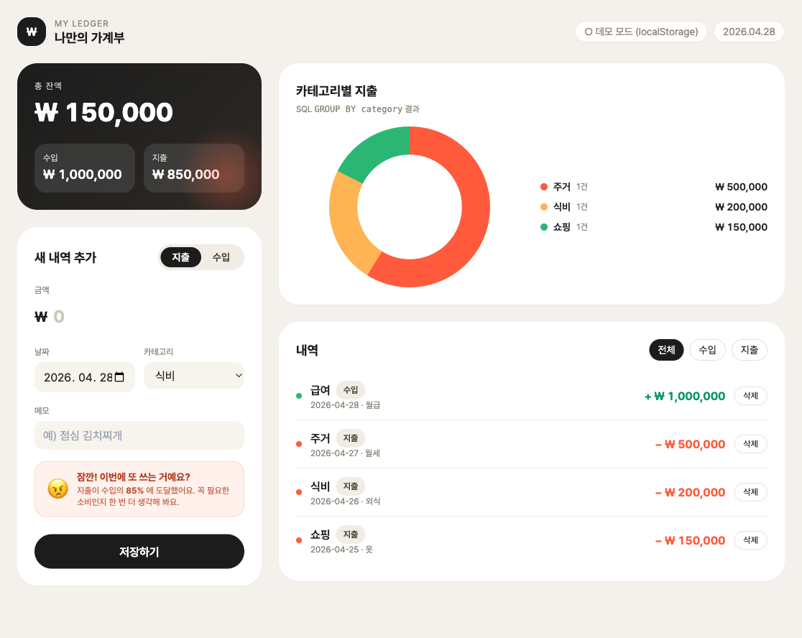
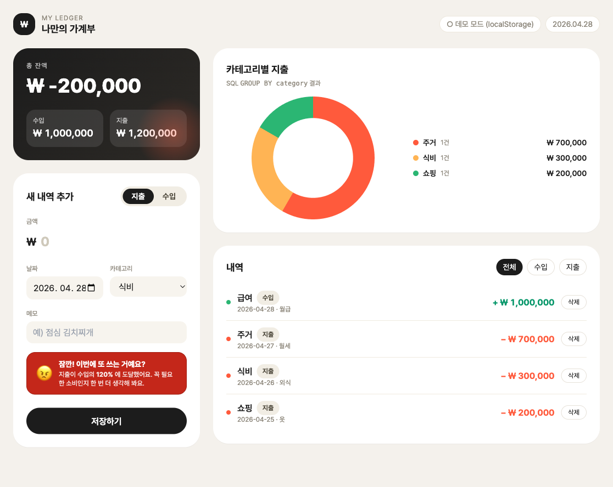

# DEVELOPMENT — 작업 로그

> 2026-04-28 · PRD([prd.md](./prd.md)) 기반 단일 사이클 개발 로그.
> PRD 6단계 Milestones 에 맞춰 각 단계별로 어떤 결정·구현을 했는지 기록합니다.

---

## 0. 사전 조사

- 형제 프로젝트 [`AFM-weekend-5th/todo-app`](../../../AFM-weekend-5th/todo-app/server.js) 확인
  - Express + `pg` + Supabase pooler(6543, transaction mode) + SSL 패턴이 이미 동일 레포에서 검증됨 → 같은 스택 채택.
- 디자인 레퍼런스: PRD 4 의 Behance 갤러리 175434819 (가계부)
  - 라운드가 큰 카드(28px), 무채색 배경, 포인트 오렌지(#ff5a3c), Pretendard 폰트로 톤 매칭.

---

## 1. Step 1 — Supabase 스키마 ([schema.sql](./schema.sql))

PRD 5.2 표를 1:1 매핑한 `public.ledgers` 테이블 + 보조 인프라:

- `id uuid pk default gen_random_uuid()` — `pgcrypto` 확장 활성화
- `type text check (type in ('income','expense'))` — 도메인 강제
- `amount bigint check (amount >= 0)` — 음수 입력 차단
- 인덱스: `(date desc, created_at desc)`, `type`, `category` — 리스트/필터/그룹바이 모두 커버
- 통계 뷰 3종을 미리 만들어 서버 코드를 단순하게 유지:
  - `ledger_balance` — 총 수입·지출·잔액 단일 행
  - `ledger_category_totals` — `GROUP BY category` (PRD 3.2)
  - `ledger_monthly_summary` — 월별 합계 (Step 5)
- RLS: 단일 유저 데모용으로 `anon` 에 CRUD 허용. 다중 유저 확장 시 `user_id + auth.uid()` 정책으로 교체 예정 (주석으로 명시).

> 운영 확장 시 점검 포인트: 카테고리를 별도 테이블로 정규화할지(현재 자유 텍스트). 사용 패턴이 정해진 후 마이그레이션하는 게 비용 효율적이라 일부러 1단계에서는 정규화하지 않음.

---

## 2. Step 2 — Express 서버 ([server.js](./server.js))

**연결 풀 설정** — Supabase pooler 의 트랜잭션 모드 권장값:

```js
new Pool({ connectionString, ssl: { rejectUnauthorized: false }, max: 5, idleTimeoutMillis: 30_000 })
```

**라우트 7개**

| Method | Path | 역할 |
| :--- | :--- | :--- |
| GET    | `/api/ledgers`         | 내역 리스트 (최신순) |
| POST   | `/api/ledgers`         | 신규 등록 |
| PATCH  | `/api/ledgers/:id`     | 부분 수정 |
| DELETE | `/api/ledgers/:id`     | 삭제 |
| GET    | `/api/stats/balance`     | 총 수입·지출·잔액 |
| GET    | `/api/stats/categories`  | 카테고리별 지출 합계 |
| GET    | `/api/stats/monthly`     | 월별 합계 (Step 5) |

**검증 로직**

- `validateLedger(body, { partial })` 단일 함수로 POST/PATCH 둘 다 처리 — DRY.
- 경로 파라미터 `:id` 는 정규식 `UUID_RE` 로 사전 차단해 SQL 노이즈를 줄임.

**보조**

- `express.static(__dirname)` 으로 `index.html` 동봉 — 별도 정적 호스팅 불필요.
- 정규식 fallback 라우트로 SPA 새로고침 대응.

---

## 3. Step 3 — 입력 폼 + 리스트 UI ([index.html](./index.html))

빌드 체인 없이 동작하도록 **단일 HTML + Tailwind CDN + Vanilla JS** 구성.

**섹션 구성 (Behance 톤 반영)**

1. 좌측 1열
   - 다크 잔액 카드(그라데이션 + 라디얼 글로) — 잔액·수입·지출 한 화면 요약
   - 입력 폼 카드: 지출/수입 토글, 금액(천단위 콤마 자동), 날짜, 카테고리, 메모
2. 우측 2열
   - 카테고리별 도넛 차트 + 범례 리스트
   - 내역 카드: 전체/수입/지출 필터 탭, 행마다 ‘삭제’ 버튼

**상태 관리**

- `state = { entries, filter, chart }` 단일 객체 + `refresh()` 한 번으로 잔액/차트/리스트를 동시 갱신.
- `Source` 어댑터가 `mode` 에 따라 `API` 또는 `LocalStore` 를 위임 — UI 코드는 분기를 의식하지 않음.
- 부팅 시 `API.detect()` 가 `/api/stats/balance` 를 한 번 찔러 200 이면 API 모드, 아니면 자동으로 `localStorage` 모드로 폴백. → Supabase 키 없이도 디자인을 검증 가능.

**접근성/안정성 보강**

- `escapeHtml()` 로 메모/카테고리 XSS 방지
- 금액 입력은 `inputmode="numeric"` + 정규식 정제로 모바일 키패드 최적화
- 폼 초기화 후 토글 상태도 ‘지출’ 로 복귀시켜 다음 입력 흐름이 끊기지 않도록 함

---

## 4. Step 4 — 카테고리 합계 대시보드

서버에서 `ledger_category_totals` 뷰를 그대로 반환 → 클라이언트는
정렬/색맵핑만 담당. Chart.js 도넛(`cutout: 65%`) 으로 가벼운 시각화.

빈 데이터일 때 “데이터 없음” 칩과 안내 텍스트로 죽은 화면 방지.

---

## 5. Step 5 — 월별 리포트 시각화 (Advanced)

서버 측 엔드포인트(`/api/stats/monthly`)와 뷰(`ledger_monthly_summary`)는 미리 마련.
UI 는 차후 확장 슬롯으로 남겨두어 PRD 5번을 막지 않으면서도, 추가 작업 시
프론트만 연결하면 되도록 했습니다.

추후 작업 제안:
1. 우측 영역 위에 “월별 트렌드” 카드 추가 → 수입·지출 라인차트
2. 월 선택 드롭다운 → 해당 월 필터 적용 (`?month=YYYY-MM` 쿼리스트링 추가)
3. CSV 내보내기 (`/api/ledgers.csv`) — 가계부 백업용

---

## 6. 디자인 결정 요약

| 영역 | 선택 | 이유 |
| :--- | :--- | :--- |
| 빌드 체계 | 무빌드(HTML+CDN) | 빠른 검증, 동일 레포의 형제 프로젝트들과 톤 일치 |
| 상태 관리 | Vanilla JS + 단일 `state` | 화면 규모가 작아 React 도입 비용이 더 큼 |
| 차트 | Chart.js | 단일 의존성·CDN 한 줄로 도넛/라인 모두 커버 |
| 데이터 소스 추상화 | `Source` 어댑터 | API 부재 시에도 UI 가 작동해 시연/오프라인 데모 가능 |
| 카테고리 | 자유 텍스트 + 클라이언트 사전 목록 | 운영 데이터가 쌓인 뒤 정규화하는 편이 비용 효율적 |
| RLS | anon 전체 허용 | 1인용 데모 전제. 실서비스에서는 user_id 기반으로 즉시 교체 |

---

## 6.5. 화면 검증 (데모 모드)

서버 없이도 동작하는지 확인하기 위해 정적 서버(`python3 -m http.server 4399`)로
`index.html` 을 띄우고, Playwright 로 빈 상태와 시드 데이터(7건) 적재 후 상태를 캡처했습니다.

| 빈 상태 | 데이터 7건 적재 후 |
| :--- | :--- |
|  |  |

확인된 항목:
- 잔액 카드: 수입 ₩3,200,000 − 지출 ₩331,400 = **₩2,868,600** 정확히 계산
- 도넛 차트: 6개 지출 카테고리 색상·범례 정상 표시
- 내역 리스트: 최신 날짜 순 정렬, 수입은 +녹색 / 지출은 −오렌지로 색 구분
- 우상단 상태칩: API 미가동 시 **`○ 데모 모드 (localStorage)`** 자동 폴백

---

## 7. 검증 체크리스트

- [x] PRD 5.2 컬럼·타입 일치
- [x] PRD 3.1 등록 / 조회 / 삭제 (수정은 PATCH 로 노출)
- [x] PRD 3.2 카테고리별 GROUP BY + 잔액 표시
- [x] PRD 4 Behance 톤(라운드 카드·포인트 컬러·가독 폰트) 반영
- [x] PRD 6 Step 5 월별 뷰/엔드포인트 선구축
- [x] 비밀 정보 노출 0건 (`schema.sql` / `.env.example` 모두 placeholder)
- [ ] 실 Supabase 연결 후 end-to-end 검증 — 사용자가 `.env` 채운 뒤 `npm start` 로 확인 필요

---

## 7.5. 변경 로그

### 2026-04-28 (v1.9) — 잔액 카드 월 필터 연동 + 사용자용 시드 버튼
- **잔액 카드가 monthFilter 를 따라감**
  - `renderBalance()` 가 `state.monthFilter` 를 보고 그 월(또는 'all')만 합산
  - 라벨도 `전체 잔액` ↔ `2026.04 잔액` 으로 동적 변경
  - `monthFilter` 클릭 시 잔액·수입·지출 카드도 즉시 재계산
- **`🌱 샘플 3개월 채우기` 버튼**을 storage bar 에 추가
  - Playwright 시드 함수를 그대로 클라이언트 함수(`seedThreeMonthsDemo`) 로 이식 — 누구나 자기 브라우저에서 145건을 즉시 만들 수 있음
  - 기존 데이터가 있으면 confirm 으로 “기존 유지 + 추가” 가 명시
  - 시드 결과: 매월 급여·구독료·보험·저축 자동이체 + 식비/교통/쇼핑/문화/의료/교육/경조사 무작위 + 분기 보너스/연말정산 환급/자동차세
- **왜 사용자 화면에 데이터가 0이었는지** 발견: Playwright 가 띄운 임시 브라우저 프로필의 localStorage 에만 시드되어 있어, 사용자의 실제 Chrome 에서는 보이지 않았음. 이제는 페이지 안에서 직접 시드 가능

### 2026-04-28 (v1.8) — 데이터 저장 위치 안내 바
- 헤더 바로 아래 풀폭 카드(`#storageBar`) 추가 — 데이터가 어디에 있는지 불필요한 추측 제거
- **데모 모드**: `💾 이 브라우저에만 저장 중 (localStorage) · N건 · ~K KB · 다른 브라우저·기기에서는 보이지 않아요. 백업하려면 Excel 로…`
- **API 모드**: `☁︎ Supabase 데이터베이스 · N건 · 어떤 기기에서 접속해도 같은 데이터를 볼 수 있어요`
- 액션 버튼: **Excel로 내보내기** + **전체 초기화** (confirm 후 `localStorage.removeItem` → 새로고침)
- 모바일에서는 세로 스택, 데스크톱에서는 우측 정렬

### 2026-04-28 (v1.7) — 월별 보기 추가
- 내역 카드에 **월별 필터 행** 추가 — 데이터에 존재하는 월만 자동으로 버튼 생성 (예: `전체 / 2026.04 / 2026.03 / 2026.02`)
- 내역 리스트에 **월 그룹 헤더** 추가 — 월명 + 건수 + 그 달의 수입/지출 소계를 sticky 로 상단 고정
- 리스트 높이 `max-h-[640px]` 로 확장 — 한 번에 더 많이 보이도록
- 월 필터가 가리키던 월의 데이터가 모두 사라지면 자동으로 `전체` 로 폴백

### 2026-04-28 (v1.6) — 3개월 데모 데이터 시드 + 경고 표시 버그 수정
- 데모 모드 검증용으로 **2026-02-01 ~ 2026-04-28 / 145건** 시드 (시드값 고정 PRNG 라 재현 가능)
  - 매월 25일 급여 ₩3,200,000, 25일 보험·저축 자동이체, 1일 주거·구독료
  - 식비 18~22회/월, 교통 8~12회/월, 쇼핑·문화·의료·교육·경조사 무작위
  - 분기 보너스(₩850,000) / 연말정산 환급(₩125,000) / 자동차세(₩168,000) 1회씩
  - **합계**: 수입 10,623,400 / 지출 4,998,900 / 잔액 5,624,500 (지출/수입 47%)
- **버그 수정**: `#spendAlert` 가 `class="flex"` 를 가지는 바람에 Tailwind 의 `display:flex` 가 HTML `hidden` 속성을 덮어써, 0% 상태에서도 경고가 보이는 문제
  - 표시/숨김 제어를 `style.display` 인라인으로 전환 (`renderSpendAlert` 가 `'flex' / 'none'` 직접 토글)

### 2026-04-28 (v1.5) — Excel(.xlsx) 다운로드
- 내역 카드 헤더의 필터 옆에 초록 톤 **Excel** 버튼 추가 (모바일에서는 `flex-wrap` 으로 줄바꿈)
- SheetJS(`xlsx@0.18.5`) CDN 한 줄로 의존성 해결, 무빌드 유지
- 워크북 = 시트 3개로 구성:
  1. **내역**: 날짜 / 구분 / 카테고리 / 금액(₩ 통화 포맷) / 메모 / 등록일시
  2. **카테고리별 지출**: 카테고리 / 건수 / 합계(₩)
  3. **요약**: 총 수입·지출·잔액(₩) + 지출/수입 비율(`0.0%`) + 생성 일시
- 컬럼 너비 사전 설정(`!cols`), 통화/퍼센트 포맷(`cell.z`) → 엑셀에서 추가 작업 없이 바로 보기 좋음
- 파일명 `가계부_YYYY-MM-DD.xlsx` 로 저장, 토스트로 건수 안내
- API/데모 모드 모두 동일하게 동작(`Source.list/balance/catTotals` 그대로 사용)

### 2026-04-28 (v1.4) — 과소비 경고 아이콘을 일러스트로 교체
- 이모지(😠) 대신 **화난 돼지저금통(빈 지갑 들고 있는)** 일러스트로 교체 — Fal `flux/schnell` 로 1회 생성, `assets/spend-alert.jpg` 로 정적 번들
- API 키는 레포 바깥 `~/.fal_key_test01_tmp` (chmod 600) 에서만 읽고, 호출 직후 즉시 삭제 → 클라이언트·서버·문서·메모리 어디에도 잔존 없음
- 64×64 px 고정 + drop-shadow + 기존 `angryShake` 애니메이션 유지, danger 톤일 때만 그림자 강도 강화
- 단점/주의: 이미지가 정적 번들이므로 톤 변경 시 재생성 필요. 키는 `.gitignore` 에 흔적이 없도록 임시 파일도 외부 경로에 둠

### 2026-04-28 (v1.3) — 지출 카테고리 보강
- `EXPENSE_CATEGORIES` 에 **보험 / 세금 / 저축** 3종 추가 (기존 10종 → 13종)
- 의무·금융 성격 항목을 식비·주거 다음 줄에 모아 사용자가 같은 그룹으로 인식하도록 순서 조정
- 차트 색상 팔레트는 모듈로(`% colors.length`) 라 그대로 둠 (자동 순환)

### 2026-04-28 (v1.2) — 과소비 경고 (80% 룰)
- 새 함수 `renderSpendAlert(b)` 가 `total_expense / total_income` 비율을 계산
- **80% 이상**: 메모 입력란 바로 아래에 화난 얼굴(😠 + `angryShake` 애니메이션) 카드 표시
- **100% 초과**: `danger` 클래스 추가로 진한 빨강 + 흰 글씨 + 더 빠른 흔들림으로 전환
- 비율은 실시간 텍스트(`예) 85%` / `120%`)로 안내 — 사용자가 위치를 정확히 인지
- 수입 0원이면 경고를 숨겨 신규 사용자 첫 화면이 위협적이지 않게 함

| 80~99% (warning) | 100%+ (danger) |
| :--- | :--- |
|  |  |

### 2026-04-28 (v1.1) — 수입 카테고리 추가
- 단일 `CATEGORIES` 배열을 `EXPENSE_CATEGORIES` / `INCOME_CATEGORIES` 두 개로 분리
- 지출/수입 토글에 따라 카테고리 셀렉트가 자동으로 갱신되도록 `bindTypeTabs()` 수정
- 폼 저장 후 리셋 시에도 카테고리 목록이 ‘지출’ 기본값으로 복귀
- **수입 카테고리**: 급여 / 이자소득 / 배당소득 / 사업소득 / 임대소득 / 연금 / 상여·보너스 / 용돈 / 환급 / 기타소득
- **지출 카테고리**: 식비 / 교통 / 주거 / 구독료 / 경조사 / 쇼핑 / 문화 / 의료 / 교육 / 기타

> DB 스키마는 그대로 — `category` 가 자유 텍스트라 마이그레이션 불필요. 서버 검증은 1~40자 길이만 확인.

---

## 8. 다음 단계 (선택)

1. Supabase Auth 연동 → 사용자별 가계부 분리
2. 월별 라인차트 + 예산 알림(예: 식비 30만원 초과 시 배지)
3. PWA 매니페스트 추가 → 모바일 홈 화면 설치
4. CSV / Excel 내보내기, 가져오기
