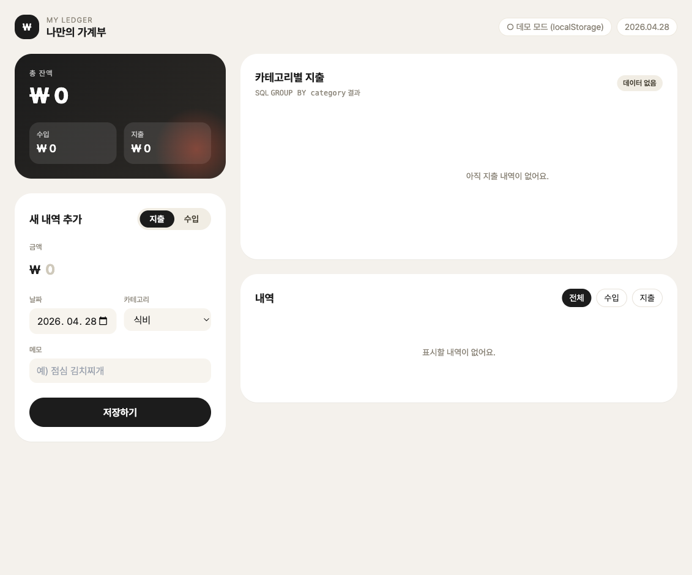
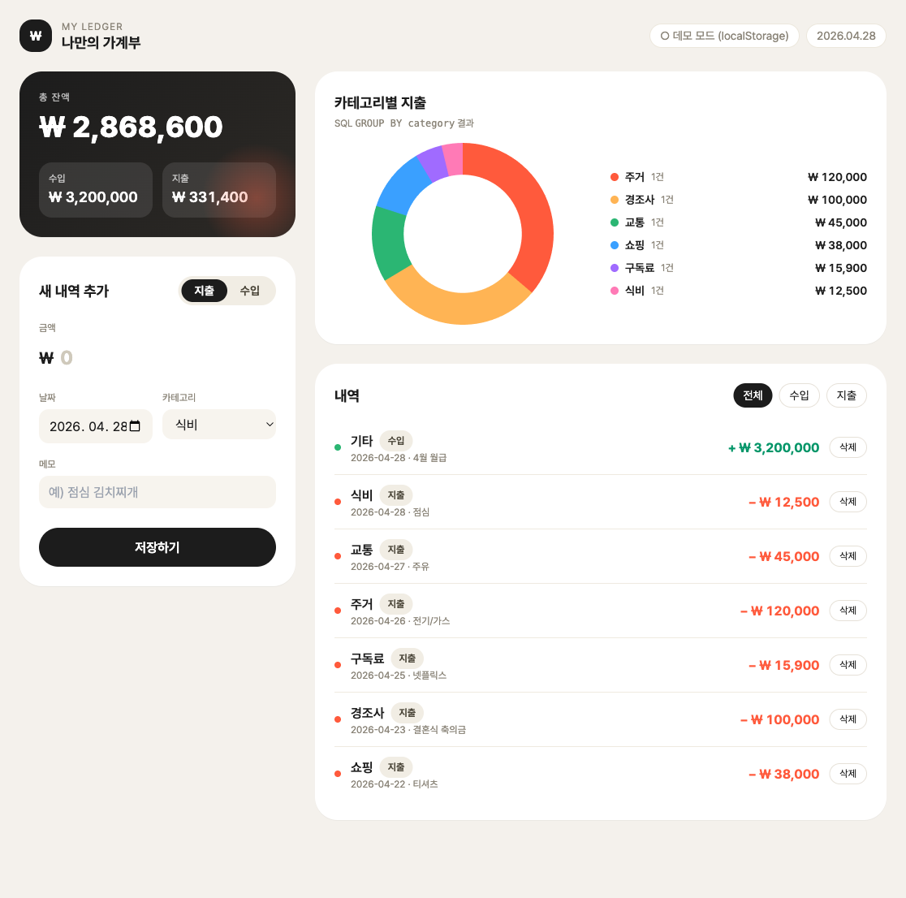

# 나만의 가계부 앱 (My Ledger)

> Week-5 Quest — PRD([prd.md](./prd.md)) 기반 1인 가계부 웹 서비스 구현

수입 / 지출 내역을 카드형 UI 로 입력하고, 카테고리별 합계를 도넛 차트로
한눈에 확인할 수 있는 단일 페이지 웹앱입니다.

| 항목 | 값 |
| :--- | :--- |
| Frontend | 단일 `index.html` + Tailwind CDN + Chart.js (Vanilla JS) |
| Backend  | Node.js + Express (`server.js`) |
| Database | Supabase (PostgreSQL, `ledgers` 테이블) |
| 설계 | PRD 6단계 Step 1 → Step 5 모두 반영 |

---

## 주요 기능

1. **수입 / 지출 내역 CRUD** — 날짜·금액·카테고리·메모·타입 등록 / 수정 / 삭제
2. **카테고리별 통계** — `GROUP BY category` SQL 뷰를 도넛 차트로 시각화
3. **잔액 요약** — 총 수입·지출과 잔액을 상단 카드에 실시간 갱신
4. **데모 모드 자동 폴백** — 서버가 꺼져 있으면 `localStorage` 만으로도 동작
5. **PRD 4 디자인** — Behance 가계부 레퍼런스의 카드형 / 라운드 UI 톤

---

## 미리보기

| 빈 상태 | 데이터 7건 |
| :--- | :--- |
|  |  |

## 빠른 시작

```bash
cd "week-5/quest/가계부앱"
npm install
cp .env.example .env          # DATABASE_URL 채우기 (SETUP.md 참고)
psql "$DATABASE_URL" -f schema.sql    # 또는 Supabase SQL Editor 에 붙여넣기
npm start                     # http://localhost:3000
```

> Supabase 설정 없이 바로 보고 싶다면 `index.html` 만 브라우저로 열어도 동작합니다 (데모 모드).

---

## 파일 구성

```
가계부앱/
├── prd.md             # 원본 요구사항
├── README.md          # 이 문서 — 프로젝트 개요
├── SETUP.md           # Supabase + 로컬 실행 셋업 가이드
├── DEVELOPMENT.md     # 단계별 작업 로그 (PRD 6단계 매핑)
├── API.md             # 서버 API 명세
├── schema.sql         # ledgers 테이블 + 통계 뷰 + RLS 정책
├── server.js          # Express API 서버
├── index.html         # 단일 페이지 프론트엔드
├── package.json       # express + pg
├── .env.example       # 환경변수 샘플
└── .gitignore
```

---

## 문서 색인

- [SETUP.md](./SETUP.md) — Supabase 프로젝트 만들기부터 서버 실행까지
- [DEVELOPMENT.md](./DEVELOPMENT.md) — PRD 6단계에 맞춘 구현 로그
- [API.md](./API.md) — REST API 명세 + 예시 응답
